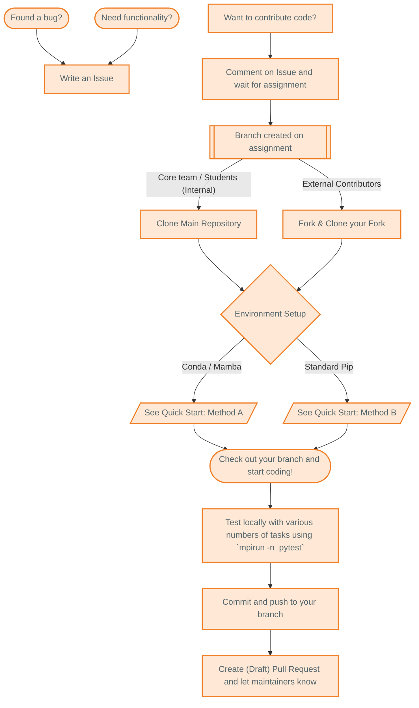
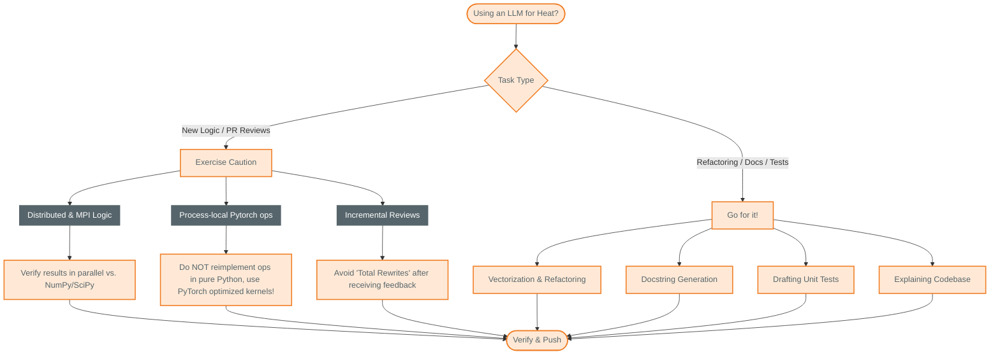

# Contributing to Heat

Thank you for your interest in contributing. To maintain project quality and support our distributed (no pun intended!) team, please follow this structured workflow.

---

## Contribution Workflow

## Getting Started
The best way to start a contribution is to open an [Issue](https://github.com/helmholtz-analytics/heat/issues/new/choose). This way, the maintainers can give you some pointers before you start and hopefully save you some time.

Don't hesitate to reach out, for instance by creating a draft PR if you need help with anything!

## Environment Setup

Follow the [Quick Start](https://heat.readthedocs.io/en/stable/quick_start.html) to set up your development environment and install the mandatory `pre-commit` hooks.

## Developing & Testing
* **Branching:** For any new development, create a new branch from the latest main or, if applicable and possible, use the specific branch created for you by the project bot.
* **Testing:** Heat is a distributed framework; all code must be verified in parallel. You can run the suite e.g. with: `mpirun -n <PROCESSES> pytest`.
If you add new functionality, you also have to add a test for this.
Keep in mind that the code must run on diverse hardware including GPUs. Don't worry if you don't have the resources to test on all necessary devices, this will happen in the continuous integration pipeline once you open the pull request and potential failures can be fixed at that time.
* **Stay synchronized:** Make sure to keep your local repository / fork synchronized with the upstream main! Regularly run `git fetch upstream; git merge upstream` if working on your fork or `git pull; git merge main` if working directly on the main repository. This way you can resolve merge conflicts early on and save a lot of work later.

* **Review process:** All contributions will be reviewed and must receive approval before being merged. In order to ensure a smooth merge process, please make your PR easy to review by (1) coding expressively with well chosen names or comments (2) describing the changes you are proposing in sufficient detail and (3) keeping the diff as small as possible, potentially by splitting up the PR if it contains multiple separable features.

*Thank you for your time!* Open source codes like Heat rely on your contributions and we appreciate your effort!

## Stylistic Guidelines
* **Python Standards:** The pre-commit hook will enforce [PEP 8](https://www.python.org/dev/peps/pep-0008/) compliance.
* **Imports:** Use `import heat as ht` and `import numpy as np`.
* **Documentation:** All public functions must follow the [Heat docstring standard](https://heat.readthedocs.io/en/stable/documentation_howto.html).

## LLM and AI Usage

We embrace the use of LLMs only if they save us time, where `total_time = development_time + review_time`.

### Instructions for AI and Contributors
If you are using an LLM to generate or review code for Heat, be aware of the following project-specific limitations:

* **Distributed logic:** LLMs consistently struggle with memory-distributed algorithms and MPI communication primitives. Make sure the correctness tests (result comparison to equivalent numpy, scipy, scikit-learn functionality) pass in parallel as well, not just on a single process.
* **Kernel implementation:** Do not reimplement kernels from scratch. Heat is designed to rely on **PyTorch's optimized kernels**; AI suggestions that attempt to bypass PyTorch are usually inefficient and will be rejected.
* **Incremental reviews:** When using an LLM to incorporate PR review feedback, make sure the model does not rewrite entire functions from scratch. "Total rewrites" make follow-up reviews excruciating.

But also:
* **Go for it!** LLMs are great for things like:
    * Code vectorization and refactoring
    * Documentation and docstring generation
    * Understanding and explaining the existing codebase
    * Drafting tests, etc.
    * creating flowcharts and diagrams to illustrate concepts, like this one:

## Next Steps

Once your PR is open, monitor the CI status. If the red cross appears, check the logs to resolve failures before requesting a final manual review. Notably:

- `codebase` CI runs on CUDA and ROCm runners and checks for test failures on CPU and GPU, and code coverage.

- the `codecov` CI  will fail if the coverage drops below the required threshold.
