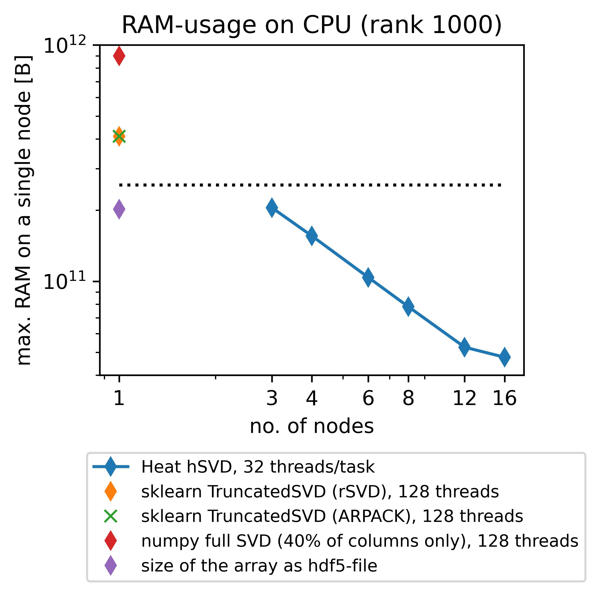
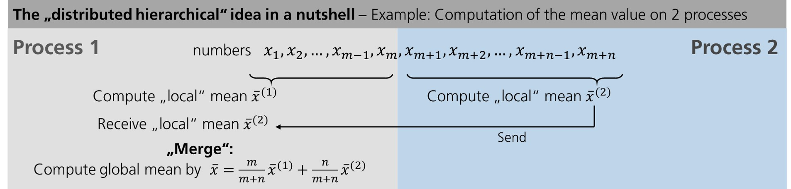

# a new feature: memory-distributed hierarchical SVD in Heat 

## TL;DR 

We have implemented an algorithm for computing an approximate, truncated SVD/PCA in Heat; see `heat.linalg.hsvd_rank` and `heat.linalg.hsvd_rtol`. What this actually is, why it is helpful, and how it works, will be explained below. 

## SVD, PCA, and their truncated counterparts in a nutshell 

Let $X \in \mathbb{R}^{m \times n}$ be a matrix, e.g., given by a data set consisting of $m$ data points $\in \mathbb{R}^n$ stacked together. The so-called **singular value decomposition (SVD)** of $X$ is given by 
```math
X = U \Sigma V^T
```
where $U \in \mathbb{R}^{m \times r_X}$ and $V \in \mathbb{R}^{n \times r_X}$ have orthonormal columns, $\Sigma = \text{diag}(\sigma_1,...,\sigma_{r_X}) \in \mathbb{R}^{r_X \times r_X}$ is a diagonal matrix containing the so-called singular values $\sigma_1 \geq \sigma_2 \geq ... \geq \sigma_{r_X} > 0$, and $r_X \leq \min(m,n)$ denotes the rank of $X$ (i.e. the dimension of the subspace of $\mathbb{R}^m$ spanned by the columns of $X$). Since $\Sigma = U^T X V$ is diangonal, one can imagine this decomposition as finding orthogonal coordinate transformations under which $X$ looks "linear". 

In data science, SVD is more often known as **principle component analysis (PCA)**, the columns of $U$ being called the principle components of $X$. In fact, in many applications **truncated SVD/PCA** suffices: to reduce $X$ to the "essential" information, one chooses a truncation rank $0 < r \leq r_X$ and considers the truncated SVD/PCA given by 
```math
X \approx X_r := U_{[:,:r]} \Sigma_{[:r,:r]} V_{[:,:r]}^T
```
where we have used `numpy`-like notation for selecting only the first $r$ columns of $U$ and $V$, respectively. The rationale behind this is that if the first $r$ singular values of $X$ are much larger than the remaining ones, $X_r$ will still contain all "essential" information contained in $X$; in mathematical terms: 
```math
\lVert X_r - X \rVert_{F}^2 = \sum_{i=r+1}^{r_X} \sigma_i^2, 
```
where $\lVert \cdot \rVert_F$ denotes the Frobenius norm. Thus, truncated SVD/PCA may be used for, e.g.,  
* filtering away non-essential information in order to get a "feeling" for the main characteristics of your data set, 
* to detect linear (or "almost" linear) dependencies in your data, 
* to generate features for further processing of your data. 

Moreover, there is a plenty of more advanced data analytics and data-based simulation techniques, such as, e.g., Proper Orthogonal Decomposition (POD) or Dynamic Mode Decomposition (DMD), that are based on SVD/PCA. 


## Computing an approximate truncated SVD/PCA in Heat 

### Just try it out 

If you want to play around with our new features in order to explore them yourself, [install Heat](https://heat.readthedocs.io/en/latest/getting_started.html#id1) and try out, e.g., the following code snippet: 

```
import heat as ht 

X = ht.load('<my_data.h5>', dataset='<name_of_my_data>', split=1)

#truncation w.r.t. rank
U_rk,S_rk,V_rk,errest_rk=ht.linalg.hsvd_rank(X, maxrank=10,compute_sv=True,silent=False)

#truncation w.r.t. accuracy
U_tol,S_tol,V_tol,errest_tol=ht.linalg.hsvd_rtol(X, rtol=1e-1,compute_sv=True,silent=False)

print(errest_rk, errest_tol)
```


Feel free to adjust `maxrank` or `rtol`, and also do not forget to try out different ways to exploit your hardware, e.g., by using multiple threads per MPI-process or running Heat on GPUs (if available). To do so, you may use the following slurm-scripts (with possible adaptations to meet the requirements of the particular HPC-system you are using): 

*Run on 4 nodes of a CPU cluster*

```
#!/bin/bash

#SBATCH --nodes=4              # do not forget to specify the partition, if your cluster needs this! 
#SBATCH --ntasks-per-node=4    # so 16 MPI-processes in total
#SBATCH --cpus-per-task=32     # here, I assume that each node has 128 (=4*32) cores
#SBATCH --time=00:10:00

export OMP_NUM_THREADS=32      # important to tell OMP/MKL to use 32 threads per MPI-process
export MKL_NUM_THREADS=32
srun --cpu-bind=threads python my_script.py
```

*Run on 4 nodes of a GPU cluster*
First, the argument `device='gpu'` needs to be added to `ht.load` in the python-script. 

```
#!/bin/bash

#SBATCH --nodes=4              # do not forget to specify the partition, if your cluster needs this! 
#SBATCH --ntasks-per-node=4    # so 16 MPI-processes in total
#SBATCH --gres=gpu:4           # use 4 GPUs per node 
#SBATCH --time=00:10:00

srun python my_script.py
```


**Note:** Since `heat.linalg.hsvd_rank` and `heat.linalg.hsvd_rtol` do not do the same as `numpy.linalg.svd`, we decided to not to use the same API; a routine `heat.linalg.svd` doing roughly the same as the corresponding `numpy`-function (but in distributed-memory parallel) will be added in the future. Moreover, following our philosophy to keep adapation of legacy `numpy`/`scikit-learn`-code as simple as possible, we plan to add a wrapper with similar API as `sklearn.TruncatedPCA`. 

### Why memory-distributed parallelism? 

When trying to compute the SVD/PCA for a large data set on a single workstation or compute node (a so-called *"shared-memory environment"*), one easily runs into troubles: let us, e.g., consider a data set of roughly 200GB that consists of about 85000 RGB-images (1024x192 pixels each), flattened into a matrix of size $\approx$ 590000 x 85000. When trying to use `scikit-learn` (which is limited to shared-memory parallelism) for computing a truncated SVD (truncation to rank 1000) of this matrix, you easily exceed typical memory bounds for "normal" compute nodes of a cluster such as 256GB (dotted line in the plot below); instead you need to use special compute nodes with a larger RAM, e.g., 1 TB. *Memory-distributed parallelism* allows you to circumvent this issue by being able to use more than one compute node resulting in a much lower memory consumption per node; we show this in the plot below on behalf of Heats new `heat.linalg.hsvd_rank`-routine that will be explained in detail afterwards.  



It is important to note that SVD/PCA is not *"embarrissingly parallel"* (or *"data parallel"*), i.e. splitting your entire data set $X$ into batches that can be processed independently on different workers is not possible due to the way how SVD/PCA works; in fact, SVD/PCA is such a valuable tool because it describes the overal structure of your entire data set instead of just looking onto subsets separately. Instead, when computing an SVD/PCA on more than one worker in parallel (i.e., making use of memory-distributed parallelism) more advanced algorithms need to be used: nontrivial communication between the workers is required. 

Fortunately, this is exactly what Heat is made for: to facilitate data analytics tasks in a memory-distributed environment on CPU/GPU-clusters. Recently, we have added so-called **hierarchical SVD** (`heat.linalg.hsvd_rank` and `heat.linalg.hsvd_rtol`) to Heats functionality, allowing the user to compute an **approximate truncated SVD/PCA** of a given data set in a memory-distributed environment. For hierarchical techniques for SVD, the respective algorithmic details, and the mathematics behind we refer to Refs. [1] and [2]; a very condensed explanation of the main ideas will be given below. 

### How it works: hiearchical SVD in a nutshell 

Let us start explaining the "distributed hierachical" idea with an example easier than SVD and restrict ourselves to 2 workers: the computation of the mean value. Let us assume we are given $m+n$ numbers of which $m$ are on worker 1 ("Process 1") and $n$ on worker 2 ("Process 2").  



First we compute the mean value of the numbers on each worker separately in parallel. Then we need to communicate our results: here, we send the mean value computed on worker 2 to worker 1. After that, the two "local" results need to be "merged" into a global result. 

In the case of SVD, the approach roughly stays the same. However, the "merging" step needs to be modified, of course, and becomes more involved. 


Again, we start with "local" computations that can be performed separately on each worker in parallel. After that, the results need to be communicated and "merged" as well; however, unlike for the mean value computation some accuracy *must* be lost in the "merging" step due to the truncation (that cannot be avoided since otherwise memory consumption could increase indefinitely). This is the reason why the hieararchical SVD algorithms yields **approximations** for the truncated SVD in general, the results being exact only in the case of so-called *low-rank data*, i.e. in the case $r \geq r_X$. 

Finally, it has to be noted that the idea outlined so far can easily be generalized from 2 workers to an arbitrary number of workers, either keeping a binary structure of the merging tree (merging two "local" results only at once) or more complicated structures allowing to merge more than two local results at once; for the details we refer either to the documentation of our hSVD-routines or the references. 

**Caveats:** By construction, the approximation of the $U$-factor of the SVD computed by hSVD will always have orthonormal columns; for the $V$-factor this does not need to be true and depends on the property of the underlying data $X$. As a "rule of thumb" one may state: hierachical SVD yields the better approximations of the true truncated SVD the more "low-rank" the underlying data is, i.e. the faster its singular values decay. (This is actually also true for other types algorithms approximating truncated SVD, e.g., randomized techniques; cf. Ref. [3].)

### Hybrid parallelism and hardware acceleration 

Heat allows you to get the best out of your existing hardware: either you can use the power of *GPUs* to speed up your computations (note that memory-distributed parallelism becomes very important here due to the rather limited memory of GPUs!) or you can profit from so-called *hybrid parallelism* on CPU. The latter means that memory-distributed parallelism (MPI via `mpi4py`) and shared-memory parallelism within an MPI-process (multithreading via `OpenMP`, inherited from our process-local compute engine `PyTorch`) go hand in hand. Below we show the speedups achieved by using Heat compared to `scikit-learn` for computing truncated SVDs with different truncation rank. 


The GPU-nodes used for this experiment were equipped with 4 Nvidia A100 80GB each, but it has to be mentioned that Heat also supports AMD GPUs (tested as part of our CI). 


### Different ways to truncate 

In all above examples, explanations, and experiments we have considered *truncation w.r.t. an a-priori fixed rank*, i.e. all appearing SVDs have been cut after a prescribed number of columns. This corresponds to our routine `heat.linalg.hsvd_rank`. A different way of doing truncations is to truncated in such a way that a *prescribed accuracy* (in terms of the relative reconstruction error, see below) is reached; this is done in `heat.linalg.hsvd_rtol`, based on corresponding error estimates from Ref. [2]: in essence, the well-known error estimate for $X-X_r$ in the Frobenius-norm (see section "SVD, PCA, and their truncated counterparts in a nutshell" above) is used to choose $r$ adaptively at each truncation. Moreover, "local" truncation errors are propagated through the "merging" tree in order to ensure that finally the upper bound on the relative reconstruction error 
```math
\frac{\lVert X - U U^T X \rVert_F}{\lVert X \rVert_F} \overset{!}{\leq} \text{rtol}
```
is satisfied, where $U$ denotes the approximate left-singular vectors of $X$ computed by `heat.linalg.hsvd_rtol`. Evaluation of the used error estimate is much cheaper than computing the true error and is also done during `heat.linalg.hsvd_rank`. *Consequently, hierarchical SVD gives you an impression on how much information of your data you loose by applying the chosen truncation scheme almost for free!*

Using `heat.linalg.hsvd` you can prescribe truncation w.r.t. both rank and accuracy (and you can access also some additional parameters of the algorithm); usage of this routine, however, is a bit tricky (as you can run into memory limitations or infinite loops by inappropriate choice of parameters) and therefore only recommended to users familar to the algorithmic details. 


## References 

1. Iwen, Ong. *A distributed and incremental SVD algorithm for agglomerative data analysis on large networks.* SIAM J. Matrix Anal. Appl., **37** (4), 2016.
2. Himpe, Leibner, Rave. *Hierarchical approximate proper orthogonal decomposition.* SIAM J. Sci. Comput., **4** (5), 2018.
3. Halko, Martinsson, Tropp. *Finding Structure with Randomness: Probabilistic Algorithms for Constructing Approximate Matrix Decompositions.* SIAM Rev. 53, **2** (2011)

