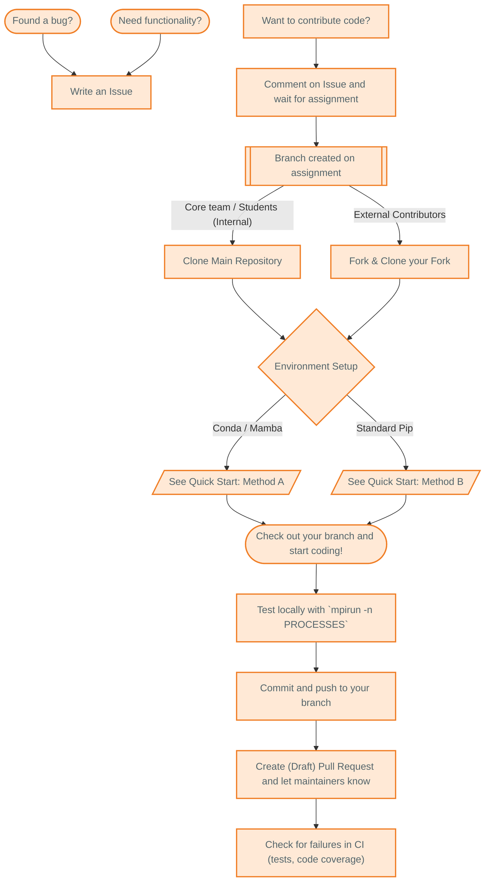
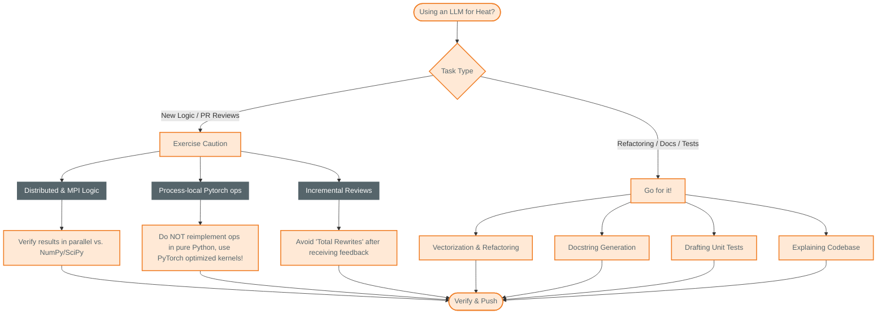

# Contributing to Heat

Thank you for your interest in contributing. To maintain project quality and support our distributed (no pun intended!) team, please follow this structured workflow.

---

## Contribution Workflow

## Getting Started
All contributions must start with an [Issue](https://github.com/helmholtz-analytics/heat/issues/new/choose).

* **Assignment:** Before writing code, pick an issue and comment to let the maintainers know you are interested. **Wait for assignment**; a bot will create a dedicated branch for you once you are assigned.

## Environment Setup
To ensure consistency across the project, we use a unified technical setup.

Follow the [New Contributors section of the Quick Start](quick_start.md#new-contributors) to set up your environment and install the mandatory `pre-commit` hooks.

## Developing & Testing
* **Branching:** Use the specific branch created for you by the project bot.
* **Testing:** Heat is a distributed framework; all code must be verified in parallel. Run the suite with: `mpirun -n <PROCESSES> python -m unittest`.
* **Commits:** We prefer a clean, logical history. Use `git rebase -i main` to tidy your commits before pushing.

## Stylistic Guidelines
* **Python Standards:** The pre-commit hook will enforce [PEP 8](https://www.python.org/dev/peps/pep-0008/) compliance.
* **Imports:** Use `import heat as ht` and `import numpy as np`.
* **Documentation:** All functions must follow the [Heat docstring standard](https://github.com/helmholtz-analytics/heat/blob/main/doc/source/documentation_howto.rst).

## LLM and AI Usage

We embrace the use of LLMs only if they save our time, where `total_time = development_time + review_time`.

### Instructions for AI and Contributors
If you are using an LLM to generate or review code for Heat, be aware of the following project-specific limitations:

* **Distributed logic:** LLMs consistently struggle with memory-distributed algorithms and MPI communication primitives. Make sure the correctness tests (result comparison to equivalent numpy, scipy, scikit-learn functionality) pass in parallel as well, not just on a single process.
* **Kernel implementation:** Do not reimplement kernels from scratch. Heat is designed to rely on **PyTorch's optimized kernels**; AI suggestions that attempt to bypass PyTorch are usually inefficient and will be rejected.
* **Incremental reviews:** When using an LLM to incorporate PR review feedback, make sure the model does not rewrite entire functions from scratch. "Total rewrites" make follow-up reviews excruciating.

But also:
* **Go for it!** LLMs are great for things like:
    * Code vectorization and refactoring
    * Documentation and docstring generation
    * Understanding and explaining the existing codebase
    * Drafting tests, etc.
    * creating flowcharts and diagrams to illustrate concepts, like this one:

## Next Steps

Once your PR is open, monitor the CI status. If the red cross appears, check the logs to resolve failures before requesting a final manual review. Notably:

- `codebase` CI runs on CUDA and ROCm runners and checks for test failures on CPU and GPU, and code coverage.

- the `codecov` CI  will fail if the coverage drops below the required threshold.
