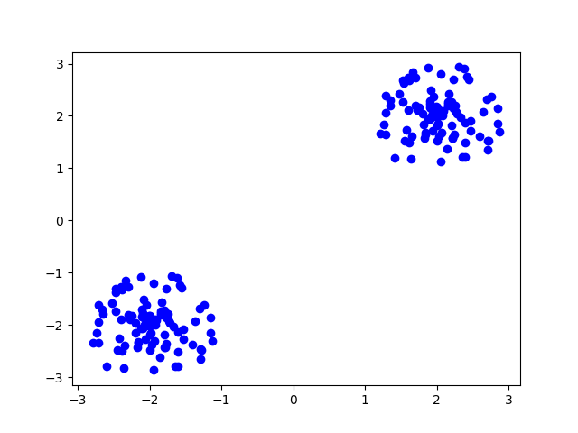
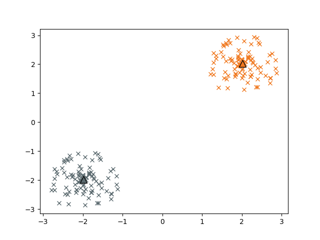

Cluster Analysis
================
**Author**: `Charlotte Debus <https://github.com/Cdebus>`_

This tutorial will demonstrate analysis with k-means and k-medians from the ``cluster`` module.
We will use matplotlib for visualization of data and results. ::

    import heat as ht
    import matplotlib.pyplot as plt

Spherical Clouds of Datapoints
------------------------------
For a simple demonstration of the clustering process and the differences between the algorithms, we will create an
artificial dataset, consisting of two circularly shaped clusters positioned at :math:`(x_1=2, y_1=2)` and :math:`(x_2=-2, y_2=-2)` in 2D space.
For each cluster we will sample 100 arbitrary points from a circle with radius of :math:`r = 1.0` by drawing random numbers
for the spherical coordinates :math:`( r\in [0,1], \phi \in [0,2\pi])`, translating these to cartesian coordinates
and shifting them by :math:`+2` for cluster ``c1`` and :math:`-2` for cluster ``c2``. The resulting concatenated dataset ``data`` has shape
:math:`(200, 2)` and is distributed among the ``p`` processes along axis 0 (sample axis)

.. code:: python

    num_ele = 100

    # Create default spherical point cloud
    # Sample radius between 0 and 1, and phi between 0 and 2pi
    r = ht.random.rand(num_ele, split=0) * radius
    phi = ht.random.rand(num_ele, split=0) * 2 * ht.constants.PI

    # Transform spherical coordinates to cartesian coordinates
    x = r * ht.cos(phi)
    y = r * ht.sin(phi)

    # Stack the sampled points and shift them to locations (2,2) and (-2, -2)
    cluster1 = ht.stack((x + 2, y + 2), axis=1)
    cluster2 = ht.stack((x - 2, y - 2), axis=1)

    data = ht.concatenate((cluster1, cluster2), axis=0)

Let's plot the data for illustration. In order to do so with matplotlib, we need to unsplit the data (gather it from
all processes) and transform it into a numpy array. Plotting can only be done on rank 0.

.. code:: python

    data_np = ht.resplit(data, axis=None).numpy()
    if ht.MPI_WORLD.rank == 0:
        plt.plot(data_np[:,0], data_np[:,1], 'bo')

This will render something like

Now we perform the clustering analysis with kmeans. We chose 'kmeans++' as an intelligent way of sampling the
initial centroids.

.. code:: python

    kmeans = ht.cluster.KMeans(n_clusters=2, init="kmeans++")
    labels = kmeans.fit_predict(data).squeeze()
    centroids = kmeans.cluster_centers_

    # Select points assigned to clusters c1 and c2
    c1 = data[ht.where(labels == 0), :]
    c2 = data[ht.where(labels == 1), :]
    # After slicing, the arrays are not distributed equally among the processes anymore; we need to balance
    c1.balance_()
    c2.balance_()

    print("Number of points assigned to c1: {} \n
           Number of points assigned to c2: {} \n
           Centroids = {}".format(c1.shape[0], c2.shape[0], centroids))

.. code:: output

    Number of points assigned to c1: 100
    Number of points assigned to c2: 100
    Centroids =  DNDarray([[ 2.0169,  2.0713],
                           [-1.9831, -1.9287]], dtype=ht.float32, device=cpu:0, split=None)

Let's plot the assigned clusters and the respective centroids:

.. code:: python

    c1_np = c1.numpy()
    c2_np = c2.numpy()

    if ht.MPI_WORLD.rank == 0:
        plt.plot(c1_np[:,0], c1_np[:,1], 'x', color='#f0781e')
        plt.plot(c2_np[:,0], c2_np[:,1], 'x', color='#5a696e')
        plt.plot(centroids[0,0],centroids[0,1], '^', markersize=10, markeredgecolor='black', color='#f0781e' )
        plt.plot(centroids[1,0],centroids[1,1], '^', markersize=10, markeredgecolor='black',color='#5a696e')

We can also cluster the data with kmedians. The respective advanced initial centroid sampling is called 'kmedians++'

.. code:: python

    kmedians = ht.cluster.KMedians(n_clusters=2, init="kmedians++")
    labels = kmedians.fit_predict(data).squeeze()
    centroids = kmedians.cluster_centers_

    # Select points assigned to clusters c1 and c2
    c1 = data[ht.where(labels == 0), :]
    c2 = data[ht.where(labels == 1), :]
    # After slicing, the arrays are not distributed equally among the processes anymore; we need to balance
    c1.balance_()
    c2.balance_()

    print("Number of points assigned to c1: {} \n
           Number of points assigned to c2: {}".format(c1.shape[0], c2.shape[0]))
Plotting the assigned clusters and the respective centroids:

.. code:: python

    c1_np = c1.numpy()
    c2_np = c2.numpy()
    if ht.MPI_WORLD.rank == 0:
        plt.plot(c1_np[:,0], c1_np[:,1], 'x', color='#f0781e')
        plt.plot(c2_np[:,0], c2_np[:,1], 'x', color='#5a696e')
        plt.plot(centroids[0,0],centroids[0,1], '^', markersize=10, markeredgecolor='black', color='#f0781e' )
        plt.plot(centroids[1,0],centroids[1,1], '^', markersize=10, markeredgecolor='black',color='#5a696e')

The Iris Dataset
------------------------------
The _iris_ dataset is a well known example for clustering analysis. It contains 4 measured features for samples from
three different types of iris flowers. A subset of 150 samples is included in formats h5, csv and netcdf in heat,
located under 'heat/heat/datasets/data/iris.h5', and can be loaded in a distributed manner with heat's parallel
dataloader

.. code:: python

    iris = ht.load("heat/datasets/data/iris.csv", sep=";", split=0)
Fitting the dataset with kmeans:

.. code:: python

    k = 3
    kmeans = ht.cluster.KMeans(n_clusters=k, init="kmeans++")
    kmeans.fit(iris)

Let's see what the results are. In theory, there are 50 samples of each of the 3 iris types

.. code:: python

    labels = kmeans.predict(iris).squeeze()

    # Select points assigned to clusters c1 and c2
    c1 = iris[ht.where(labels == 0), :]
    c2 = iris[ht.where(labels == 1), :]
    c3 = iris[ht.where(labels == 2), :]
    # After slicing, the arrays are not distributed equally among the processes anymore; we need to balance
    c1.balance_()
    c2.balance_()
    c3.balance_()

    print("Number of points assigned to c1: {} \n
           Number of points assigned to c2: {} \n
           Number of points assigned to c3: {} ".format(c1.shape[0], c2.shape[0], c3.shape[0]))
