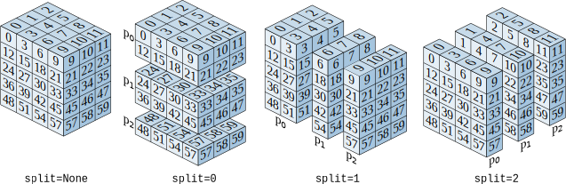
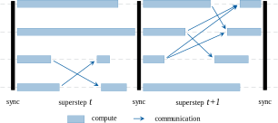

Parallel Computation
====================

One of Heat's strength lies in its ability to heavily parallelize computations. By default, Heat utilizes all available cores in your processor via OpenMP multi-threading. However, it is also possible to further speed-up processing with GPU acceleration or by scale-out in a cluster system using MPI. In the following tutorial you will learn how to exploit Heat's parallel processing features.

GPU Acceleration
----------------

.. warning::
    Please make sure that you have an NVidia GPU in your system for the following code snippets.

GPUs can accelerate applications running on the CPU by offloading some or all of the time consuming portions of the code. This is particularly for highly compute-intensive programs with low to medium memory consumption. From a user's perspective, the application runs faster because it's using the massively parallel processing power of the GPU to boost performance. Heat allows you to allocate ``DNDarrays`` on the GPU as follows.

.. code:: python

    ht.arange(5, device="gpu")

Output:

.. code:: text

    DNDarray([0, 1, 2, 3, 4], dtype=ht.int32, device=cuda:0, split=None)

As you can see the device information has changed from ``cpu:0`` to ``cuda:0``, denoting that the ``DNDarray``'s data is now residing in GPU memory of the `CUDA <https://developer.nvidia.com/cuda-zone>`_ compute backend.

We can move data back and forth the CPU and GPU by calling the respective function on the ``DNDarray``.

.. code:: python

    a = ht.arange(5, device="gpu")
    a.cpu()

Output:

.. code:: text

    DNDarray([0, 1, 2, 3, 4], dtype=ht.int32, device=cpu:0, split=None)

Manually, allocating or moving all ``DNDarrays`` between CPU and GPU can quickly become tedious. Hence, Heat allows you to set a default device for all computations.

.. code:: python

    ht.use_device('gpu')
    ht.zeros((3, 4,))

Output:

.. code:: text

    DNDarray([[0., 0., 0., 0.],
              [0., 0., 0., 0.],
              [0., 0., 0., 0.]], dtype=ht.float32, device=cuda:0, split=None)

Finally, operations on ``DNDarrays`` on GPUs can be performed as we are used to from its CPU counterpart.

.. code:: python

    ht.use_device('gpu')
    ht.full((3, 4,), fill_value=9) + ht.ones((3, 4,))

Output:

.. code:: text

    DNDarray([[10., 10., 10., 10.],
              [10., 10., 10., 10.],
              [10., 10., 10., 10.]], dtype=ht.float32, device=cuda:0, split=None)

Distributed Computing
---------------------

.. warning::
    For the following code examples, make sure to you have `MPI <https://computing.llnl.gov/tutorials/mpi/>`_ installed.

With Heat you can even compute in distributed memory environments with multiple computation nodes, like modern high-performance cluster systems. For this, Heat makes use of the fact that operations performed on multi-dimensional arrays tend to be identical for all data items. Hence, they can be processed in data-parallel manner. Heat partitions the total number of data items equally among all processing nodes. A ``DNDarray`` assumes the role of a virtual overlay over these node-local data portions and manages them for you while offering the same interface. Consequently, operations can now be executed in parallel. Each processing node applies them locally to their own data chunk. If necessary, partial results are communicated and automatically combined behind the scenes for correct global results.

Data chunking in Heat is always done along a singular axis, i.e. a one-dimensional domain decomposition. You can specify this axis by using the ``split`` parameter in operations and ``DNDarray`` creation functions. The picture above shows the result of setting different ``split`` axis on a three-dimensional volume and three processing nodes called :math:`p_0, p_1` and :math:`p_2`. A Heat ``DNDarray`` without any split, i.e. ``split=None`` (default), results in redundant copy on each computation node.

.. note::
    In the following example we assume three execution nodes. We distinguish between them in the output by showing them as ``[node/total nodes]``.

.. note::

    If you're running the following examples in a distributed computation environment, please modify your program invocation from ``python ./my_script.py`` to ``mpirun -p <number_of_processors> python ./my_script.py``. By the way, invoking a Heat program like this on your laptop or workstation also works.

.. note ::
   Most of the examples throughout the documentation display the split ``DNDarrays``. This is not the default behavior when displaying a ``DNDarray``, and the full array will be printed multiple times (based on the number of processes). This behaviour can be changed using the ``ht.local_printing()`` option or by printing the local arrays for each process with the property `larray <https://heat.readthedocs.io/en/latest/autoapi/heat/core/dndarray/index.html?highlight=dndarray#heat.core.dndarray.DNDarray.larray>`_.

.. code:: python

    ht.arange(5, split=0)

Output:

.. code:: text

    DNDarray([0, 1, 2, 3, 4], dtype=ht.int32, device=cpu:0, split=0)

    [0/3] DNDarray([0, 1], dtype=ht.int32, device=cpu:0, split=0)
    [1/3] DNDarray([2, 3], dtype=ht.int32, device=cpu:0, split=0)
    [2/3] DNDarray([4], dtype=ht.int32, device=cpu:0, split=0)

This can also be done along other axes for arrays with larger dimensions.

.. code:: python

    ht.zeros((3, 4,), split=1)

Output:

.. code:: text

    DNDarray([[0., 0., 0., 0.],
              [0., 0., 0., 0.],
              [0., 0., 0., 0.]], dtype=ht.float32, device=cpu:0, split=None)

    [0/3] DNDarray([[0., 0.],
                    [0., 0.],
                    [0., 0.]], dtype=ht.int32, device=cpu:0, split=0)
    [1/3] DNDarray([[0.],
                    [0.],
                    [0.]], dtype=ht.int32, device=cpu:0, split=0)
    [2/3] DNDarray([[0.],
                    [0.],
                    [0.]], dtype=ht.int32, device=cpu:0, split=0)

As previously explained, specifying no ``split`` axis or setting it explicitly to ``None`` results in a redundant copy on each node.

.. code:: python

    ht.arange(5, split=None)

Output:

.. code:: text

    DNDarray([0, 1, 2, 3, 4], dtype=ht.int32, device=cpu:0, split=None)

    [0/3] DNDarray([0, 1, 2, 3, 4], dtype=ht.int32, device=cpu:0, split=None)
    [1/3] DNDarray([0, 1, 2, 3, 4], dtype=ht.int32, device=cpu:0, split=None)
    [2/3] DNDarray([0, 1, 2, 3, 4], dtype=ht.int32, device=cpu:0, split=None)

You may also modify the data partitioning of a Heat array by using the ``resplit()`` function. This allows you to repartition the data as you so choose. Please note, that this should be used sparingly and for small data amounts only, as it entails data communication over network.

.. code:: python

    a = ht.arange(5, split=None)
    a.resplit(0)

Output:

.. code:: text

    DNDarray([0, 1, 2, 3, 4], dtype=ht.int32, device=cpu:0, split=0)

    [0/3] DNDarray([0, 1], dtype=ht.int32, device=cpu:0, split=0)
    [1/3] DNDarray([2, 3], dtype=ht.int32, device=cpu:0, split=0)
    [2/3] DNDarray([4], dtype=ht.int32, device=cpu:0, split=0)

The result of an operation on a Heat tensor will in most cases preserve the split of the respective operands. However, in some cases the split axis might change. For example, a transpose of a Heat ``DNDarray`` will equally transpose the split axis. Furthermore, a reduction operations, e.g. `sum()` that is performed across the split axis, might remove data partitions entirely.

.. code:: python

    a = ht.ones((3, 4,), split=0)
    a.sum()

Output:

.. code:: text

    DNDarray([12.], dtype=ht.float32, device=cpu:0, split=None)

The previously ``split=0`` matrix is ``split=None`` after the reduction operation. Obviously, we can also perform operations between (differently) split ``DNDarrays``.

.. code:: python

    a = ht.ones((3, 4,), split=1)
    b = ht.arange(4)

    a + b

Output:

.. code:: text

    DNDarray([[1., 2., 3., 4.],
              [1., 2., 3., 4.],
              [1., 2., 3., 4.]], dtype=ht.float32, device=cpu:0, split=0)

    [0/3] DNDarray([1., 2., 3., 4.], dtype=ht.int32, device=cpu:0, split=None)
    [1/3] DNDarray([1., 2., 3., 4.], dtype=ht.int32, device=cpu:0, split=None)
    [2/3] DNDarray([1., 2., 3., 4.], dtype=ht.int32, device=cpu:0, split=None)

Technical Details
^^^^^^^^^^^^^^^^^

On a technical level, Heat is inspired by the so-called `Bulk Synchronous Parallel (BSP) <https://en.wikipedia.org/wiki/Bulk_synchronous_parallel>`_ processing model. Computations proceed in a series of hierarchical supersteps, each consisting of a number of node-local computations and subsequent communications. In contrast to the classical BSP model, communicated data is available immediately, rather than after the next global synchronization. In Heat, global synchronizations only occurs for collective MPI calls as well as at the program start and termination.

Distributed Interactive Interpreter
^^^^^^^^^^^^^^^^^^^^^^^^^^^^^^^^^^^

Heat ships with a distributed interactive Python interpreter that allows you to prototype and debug distributed applications. It can be found in the Heat sources in the path `scripts/interactive.py` or you just grab it directly

.. code:: bash

    wget https://raw.githubusercontent.com/helmholtz-analytics/heat/master/scripts/interactive.py

You can start the distributed interactive interpreter by invoking the following command.

.. code:: bash

    mpirun -s all -np <procs> python interactive.py

.. note::

    The interactive interpreter does only support a subset of all controls commands.

Parallel Performance
--------------------

When working with parallel and distributed computation in Heat there are some best practices for you may to know about. The following list covers the major ones.

Dos
^^^

* Use the high-level Heat API
    * computational kernels are optimized
    * Python constructs (e.g. loops) may be slow
* Split large data amounts
    * often this along the 'observations/samples/time' dimension
    * large intermediate matrices
* Have redundant copies (``split=None``) of small, frequently accessed matrices

Dont's
^^^^^^

* Avoid extensive data copying, e.g.
    * operations with operands of different splits (except ``None``)
    * reshape() that actually change the array dimensions (adding extra dimensions with size 1 is fine)
* Overly use the GPU
    * computation-intensive operations are usually a good fit
    * operations extensively accessing memory only (e.g. sorting) are not
