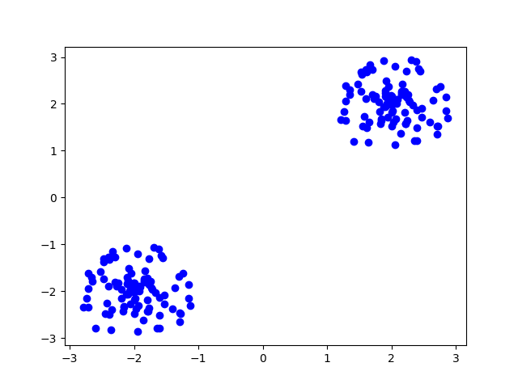
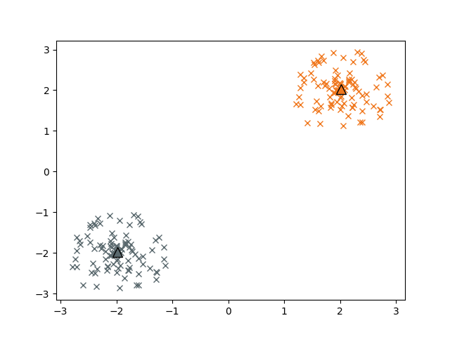
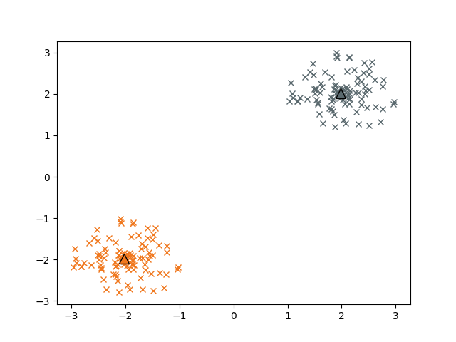

# Cluster Analysis

This tutorial will demonstrate analysis with k-means and k-medians from the `cluster` module.
We will use matplotlib for visualization of data and results. ::

```python
import heat as ht
import matplotlib.pyplot as plt
```

## Spherical Clouds of Datapoints

For a simple demonstration of the clustering process and the differences between the algorithms, we will create an
artificial dataset, consisting of two circularly shaped clusters positioned at $(x_1=2, y_1=2)$ and $(x_2=-2, y_2=-2)$ in 2D space.
For each cluster we will sample 100 arbitrary points from a circle with radius of $R = 1.0$ by drawing random numbers
for the spherical coordinates $( r\in [0,R], \phi \in [0,2\pi])$, translating these to cartesian coordinates
and shifting them by $+2$ for cluster `c1` and $-2$ for cluster `c2`. The resulting concatenated dataset `data` has shape
$(200, 2)$ and is distributed among the `p` processes along axis 0 (sample axis)

```python
num_ele = 100
R = 1.0

# Create default spherical point cloud
# Sample radius between 0 and 1, and phi between 0 and 2pi
r = ht.random.rand(num_ele, split=0) * R
phi = ht.random.rand(num_ele, split=0) * 2 * ht.constants.PI

# Transform spherical coordinates to cartesian coordinates
x = r * ht.cos(phi)
y = r * ht.sin(phi)


# Stack the sampled points and shift them to locations (2,2) and (-2, -2)
cluster1 = ht.stack((x + 2, y + 2), axis=1)
cluster2 = ht.stack((x - 2, y - 2), axis=1)

data = ht.concatenate((cluster1, cluster2), axis=0)
```

Let's plot the data for illustration. In order to do so with matplotlib, we need to unsplit the data (gather it from
all processes) and transform it into a numpy array. Plotting can only be done on rank 0.

```python
data_np = ht.resplit(data, axis=None).numpy()
if ht.MPI_WORLD.rank == 0:
    plt.plot(data_np[:,0], data_np[:,1], 'bo')
    plt.show()
```

This will render something like


/// caption
Datapoints
///

Now we perform the clustering analysis with kmeans. We chose kmeans++ as an intelligent way of sampling the
initial centroids.

```python
kmeans = ht.cluster.KMeans(n_clusters=2, init="kmeans++")
labels = kmeans.fit_predict(data).squeeze()
centroids = kmeans.cluster_centers_

# Select points assigned to clusters c1 and c2
c1 = data[ht.where(labels == 0), :]
c2 = data[ht.where(labels == 1), :]
# After slicing, the arrays are not distributed equally among the processes anymore; we need to balance
c1.balance_()
c2.balance_()

print(f"Number of points assigned to c1: {c1.shape[0]} \n"
    f"Number of points assigned to c2: {c2.shape[0]} \n"
    f"Centroids = {centroids}")
```

```
Number of points assigned to c1: 100
Number of points assigned to c2: 100
Centroids =  DNDarray([[ 2.0169,  2.0713],
                       [-1.9831, -1.9287]], dtype=ht.float32, device=cpu:0, split=None)
```

Let's plot the assigned clusters and the respective centroids:

```python

c1_np = c1.numpy()
c2_np = c2.numpy()

if ht.MPI_WORLD.rank == 0:
    plt.plot(c1_np[:,0], c1_np[:,1], 'x', color='#f0781e')
    plt.plot(c2_np[:,0], c2_np[:,1], 'x', color='#5a696e')
    plt.plot(centroids[0,0],centroids[0,1], '^', markersize=10, markeredgecolor='black', color='#f0781e' )
    plt.plot(centroids[1,0],centroids[1,1], '^', markersize=10, markeredgecolor='black',color='#5a696e')
    plt.show()
```


/// caption
kmeans clustering
///

We can also cluster the data with kmedians. The respective advanced initial centroid sampling is called kmedians++.

```python

kmedians = ht.cluster.KMedians(n_clusters=2, init="kmedians++")
labels = kmedians.fit_predict(data).squeeze()
centroids = kmedians.cluster_centers_

# Select points assigned to clusters c1 and c2
c1 = data[ht.where(labels == 0), :]
c2 = data[ht.where(labels == 1), :]
# After slicing, the arrays are not distributed equally among the processes anymore; we need to balance
c1.balance_()
c2.balance_()

print(f"Number of points assigned to c1: {c1.shape[0]} \n"
        f"Number of points assigned to c2: {c2.shape[0]} \n"
        f"Centroids = {centroids}")
```

Plotting the assigned clusters and the respective centroids:

```python
c1_np = c1.numpy()
c2_np = c2.numpy()
if ht.MPI_WORLD.rank == 0:
    plt.plot(c1_np[:,0], c1_np[:,1], 'x', color='#f0781e')
    plt.plot(c2_np[:,0], c2_np[:,1], 'x', color='#5a696e')
    plt.plot(centroids[0,0],centroids[0,1], '^', markersize=10, markeredgecolor='black', color='#f0781e' )
    plt.plot(centroids[1,0],centroids[1,1], '^', markersize=10, markeredgecolor='black',color='#5a696e')
    plt.show()
```


/// caption
kmedians clustering
///

## The Iris Dataset

The _iris_ dataset is a well known example for clustering analysis. It contains 4 measured features for samples from
three different types of iris flowers. A subset of 150 samples is included in formats h5, csv and netcdf in Heat,
located under 'heat/heat/datasets', and can be loaded in a distributed manner with Heat's parallel
dataloader

```python
iris = ht.load("heat/datasets/iris.csv", sep=";", split=0)
```

Fitting the dataset with kmeans:

```python
k = 3
kmeans = ht.cluster.KMeans(n_clusters=k, init="kmeans++")
kmeans.fit(iris)
```

Let's see what the results are. In theory, there are 50 samples of each of the 3 iris types

```python
labels = kmeans.predict(iris).squeeze()

# Select points assigned to clusters c1 and c2
c1 = iris[ht.where(labels == 0), :]
c2 = iris[ht.where(labels == 1), :]
c3 = iris[ht.where(labels == 2), :]
# After slicing, the arrays are not distributed equally among the processes anymore; we need to balance
c1.balance_()
c2.balance_()
c3.balance_()

print(f"Number of points assigned to c1: {c1.shape[0]} \n"
        f"Number of points assigned to c2: {c2.shape[0]} \n"
        f"Number of points assigned to c3: {c3.shape[0]}")
```
